# Find the Best Karak: GitHub Copilot Tutorial

## Introduction

 In this tutorial, we will guide you step-by-step to create a website to display and rate the Karak restaurants in Qatar. You'll learn how to leverage GitHub Copilot to develop this website using HTML and JavaScript. By the end of this tutorial, you’ll be able to create an engaging website that runs on your local PC.

## Prerequisites

* Basic knowledge of HTML and JavaScript

* Visual Studio Code
  ```bash
  https://code.visualstudio.com/download
  ```
  
* GitHub account with access to GitHub Copilot.
  
  ```bash
  vscode://github.copilot-chat
  ```

## Setup

1. Fork the repository on GitHub to store your project files.

    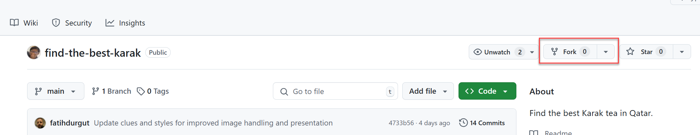

2. Give a repository name and description.

    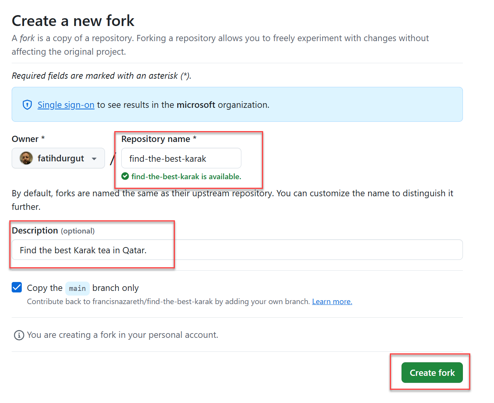

3. Copy the repository URL.

    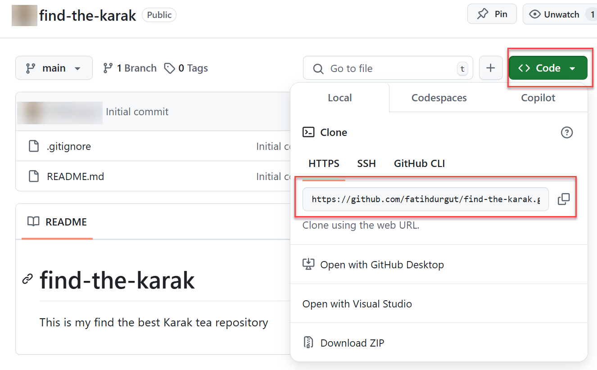

4. Clone the repository to your local machine using VSCode. (from the Source Control view:  (CTRL + SHIFT + G)) 

    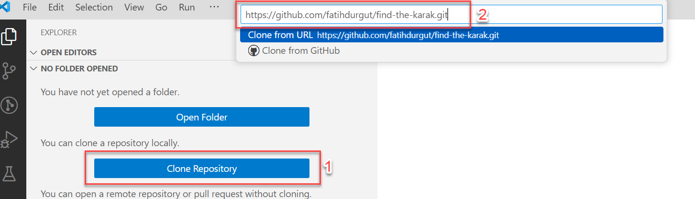

5. Open the project in your code editor.

    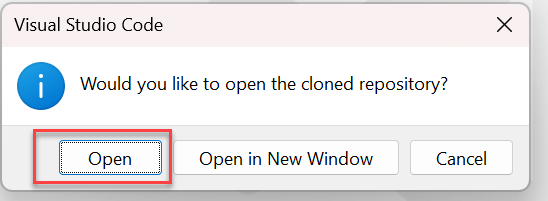
   
6. If prompted to trust the authors, click on "Yes, I trust the authors".

7. Inspect the contents of the file karak.json
   
## Development

### Task 1: Open GitHub Copilot Chat

1. Open the Copilot Edits view from the Command Center Copilot menu or press ```Ctrl+Shift+I```

    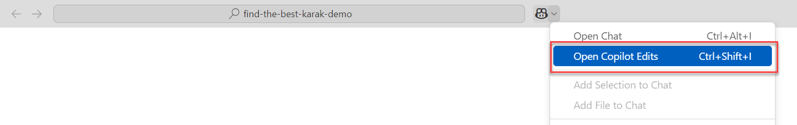

2. Then drag and drop the karak.json file from Explorer tab to "Working Set" field on the Copilot panel.

    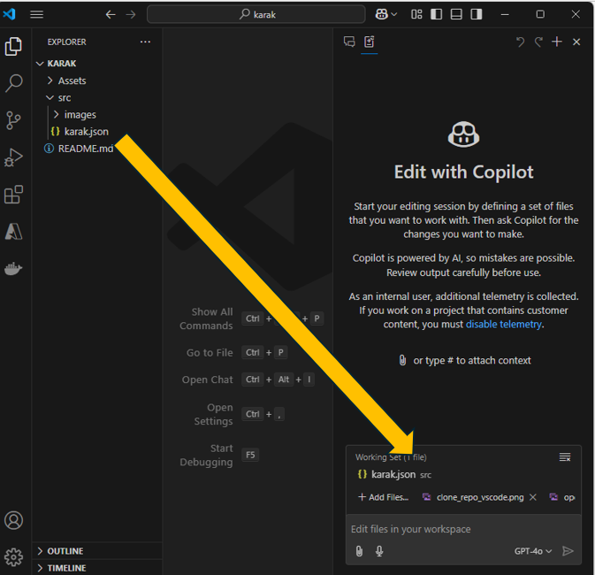

> [!TIP]
> Use Copilot Edits to start an AI-powered code editing session and iterate quickly on code changes across multiple files by using natural language. Copilot Edits applies the edits directly in the editor, where you can review them in-place, with the full context of the surrounding code.

### Task 2: Ask GitHub Copilot to Create your workspace with neccessary files

1. Use your creativity to ask Copilot to create the necessary files for your project. You can provide a prompt that describes the website you want to build and the features you need. For example, you can ask Copilot to generate an HTML file with a heading, paragraph, input field, and submit button, as well as a JavaScript file to fetch clues from a JSON file.

   <details>
        <summary>Here is a good prompt that you can use.</summary>

         I'm creating a website called "Find the best Karak tea in Qatar" using HTML and JavaScript. The website should display various restaurant names, description and images in the HTML page. You can find the titles, descriptions and images in karak.json. Please help me generate the basic HTML, JavaScript and CSS files needed for this website in the root folder. The HTML file will include a heading, a paragraph to display description, a star based rating system for the following properties: Taste, Ambience, Price, Fragrance and Overall rating.

   </details>
   &nbsp;

2. If everything goes well, GitHub Copilot will generate the necessary files in the "root" folder. Review the generated files and "Accept" the changes if they meet your requirements. If the generated content is not satisfactory, press "Discard" and refine your prompt to improve the results.

   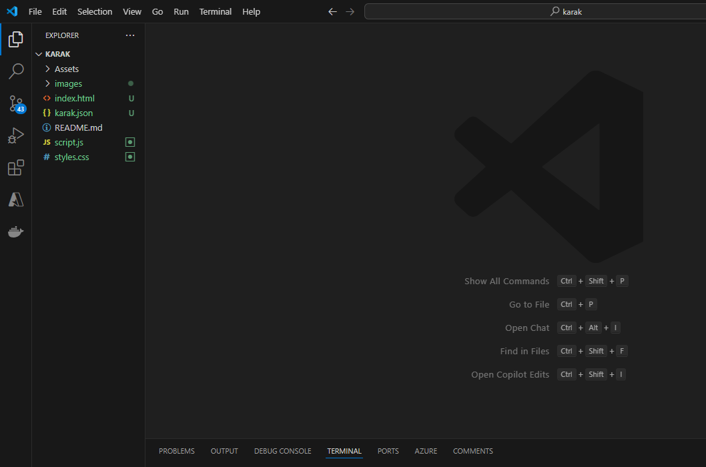

### Task 3: Test the Website

1. If the extension "Live server" is not installed, install the extension "Live Server" in Visual Studio Code. 

    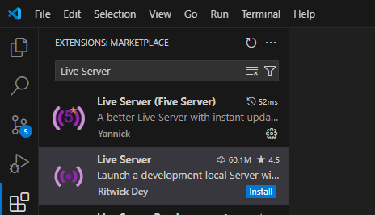

2. Go back to the explorer view, right click the index.html file, and select "Open with Live Server" option. 

   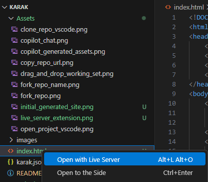
   &nbsp;

3. Live server should automatically open your browser and display the web page.

   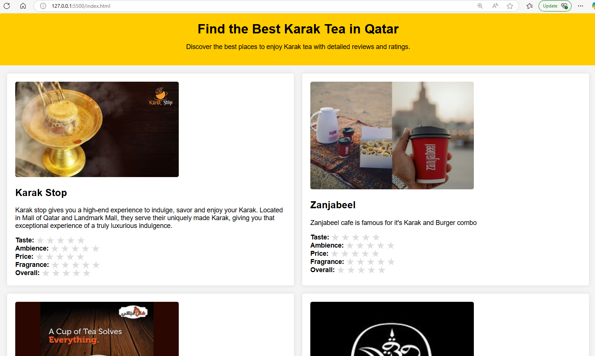

> [!IMPORTANT]  
> You may need to update the `script.js` or `index.html` files to resolve any issues or to enhance the site's functionality.

If the stars are not clickable, please provide the following prompt:

```bash
User should be able to click on the star rating to provide the ratings.
```

If the property names are not displayed, please provide the following prompt:

```bash
The property names should be displayed
```

If restaurant entries are not displayed in a two column format, please provide the following prompt:

```bash
The restaurant items should be displayed in a two column layout
```
If the images for each restaurant is too big, please provide the following prompt: 

```bash
restaurant images should have a maximum width of 400px
```

### Task 4: Make changes to the website.

1. Return to Visual Studio Code and inspect the "Working Set" panel. You should see all the newly created files alongside `karak.json`. If they are not visible, drag and drop them from the Explorer window again.

2. Ask Copilot to change the rating criteria of Price to Value for Money.

<details>
      <summary> Here is a good prompt that you can use </summary>

         Please change the rating criteria to "Taste, Fragrance, Ambience, Value for Money, and Overall rating"
 </details>
 &nbsp;

GitHub Copilot will generate the necessary modifications to your project files. Review and accept the changes.

3. Ask Copilot to display numerical values for the user ratings (for example, 4 out of 5).

<details>
      <summary> Here is a good prompt that you can use </summary>

        Please display the rating values when user selects a rating. For example, Taste: (4/5) when user selects 4 stars.
 </details>
 &nbsp;

4. Ask Copilot to enter their feedback for restaurants.

<details>
      <summary> Here is a good prompt that you can use </summary>
 
       Provide an option for users to enter their feedback as text for each karak shop, and submit the feedback and ratings.
</details>
&nbsp;

5. Display a banner image for the website

<details>
      <summary> Here is a good prompt that you can use </summary>
 
       Display a scrollable banner image in the website, using images from images/banner folder. The banner image should scroll only when user clicks left or right arrows. Banner images should not scroll if the user is not clicking the arrow.
</details>
&nbsp;

6. Add social media sharing options.
<details>
     <summary>Here is a good prompt that you can use </summary>
 
     Add an option to share the restaurant review and rating in Facebook, Twitter and Instagram.
</details>
&nbsp;

7. Add geo-location features.
   <details>
       <summary>Here is a good prompt that you can use. </summary>

       add a google map icon next to the restaurant name. The latitude and longitude are provided in karak.json. When the user clicks the map icon, the map with restaurant location should pop-out.
   </details>


### Task 6: Enhance the Application with Additional Features

1. Now, it's your opportunity to showcase your creativity by adding extra features to your application. Consider the following enhancements:

   * Create an REST server in Node.JS (or Python) using Copilot, that will receive a JSON payload, print the contents, and return with HTTP 200/OK status.
   * Send the user rating and feedback (from the web page script) to the REST server.
   * Provide social media based single-sign on options for users (for example, sign-in using outlook / facebook). 

2. Use GitHub Copilot to assist you in implementing these features. Review and test the changes thoroughly to ensure they meet your requirements.


### Task 7: Commit and Push Changes

1. Once you are satisfied with the changes, save the files and end your GitHub Copilot edit session by clicking the "Done" button. Commit the changes to your local repository by clicking the source control button on the left panel of VSCode and entering a commit message.

   

2. You can also use GitHub Copilot to generate a commit message with small magic button in the message box.

   

3. Sync the changes to your GitHub repository

   

### Task 8: Share your Project

1. Share the link to your GitHub repository with friends and family to showcase your treasure hunt game

> [!TIP]
> Check out my online treasure hunt game "Find the Best Karak" on GitHub: [Repository Link]

## Congratulations


